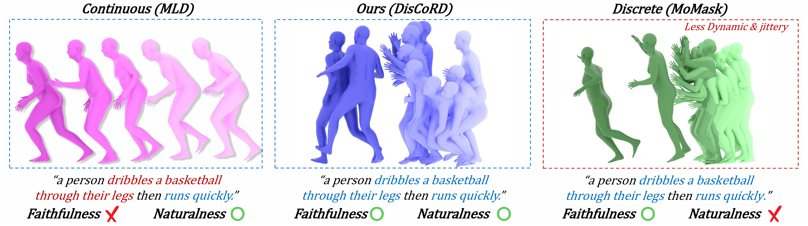

# DisCoRD: Discrete Tokens to Continuous Motion via Rectified Flow Decoding [ICCV 2025, Highlight]



<p align="center">
  <a href='https://arxiv.org/abs/2411.19527'>
  </a>
  <a href='https://arxiv.org/pdf/2411.19527.pdf'>
  </a>
  <a href='https://whwjdqls.github.io/discord.github.io/'>
  </a>
  <a href='https://paperswithcode.com/sota/motion-synthesis-on-humanml3d?p=discord-discrete-tokens-to-continuous-motion'>
  </a>
</p>

<p align="center">
  <p align="center">
      <a href='https://github.com/whwjdqls/' target='_blank'>Jungbin Cho</a><sup>*</sup>&emsp;
      <a href='https://junwankimm.github.io/' target='_blank'>Junwan Kim</a><sup>*</sup>&emsp;
      <a href='https://mirlab.yonsei.ac.kr/people/jisoo.html/' target='_blank'>Jisoo Kim</a>&emsp;
      <a href='https://mirlab.yonsei.ac.kr/people/minseo.html/' target='_blank'>Minseo Kim</a>&emsp;
      <a href='' target='_blank'>Mingu Kang</a>&emsp;
      <a href='https://www.csehong.com/' target='_blank'>Sungeun Hong</a>&emsp;
      <a href='https://ami.postech.ac.kr/members/tae-hyun-oh/' target='_blank'>Tae-Hyun Oh</a>&emsp;
      <a href='https://yj-yu.github.io/home/' target='_blank'>Youngjae Yu</a><sup>†</sup>&emsp;
    </p>
  <p align="center">
    <sup>*</sup>Equal Contribution. <sup>†</sup>Corresponding Author.
  </p>
</p>

---

Official pytorch code release of "[DisCoRD: Discrete Tokens to Continuous Motion via Rectified Flow Decoding](https://arxiv.org/abs/2411.19527)"

## 📨 News


🚀 **01/Jan/25** - Released the inference & evaluation code

🚀 **06/June/25** - DisCoRD has be accepted to ICCV 2025!


🚀 **24/July/25** - DisCoRD will be presented as a Highlight paper!
## ⚙️ Settings
```bash
git clone https://github.com/whwjdqls/DisCoRD
cd DisCoRD
```
### Environments
This codebase was tested on Python 3.8.5 with cuda 11.8
``` bash
conda env create -f environment.yaml
conda activate discord
```

### Download Checkpoints
DisCoRD can be easily built on any VQ-VAE-based motion generation model. We release checkpoints built on [MoMask: Generative Masked Modeling of 3D Human Motions](https://arxiv.org/abs/2312.00063).

1. Download Momask checkpoints. Detailed guidelines can be founded in [here](https://github.com/EricGuo5513/momask-codes).

    ``` bash
    bash prepare/download_models.sh
    ```
2. Download evaluation models and gloves

    ``` bash
    bash prepare/download_evaluator.sh
    bash prepare/download_glove.sh
    ```
3. Download DisCoRD checkpoint and place it in ./checkpoints.
    ``` bash
    https://drive.google.com/file/d/1glQFuMvWI_dKeQeS7s8V_4zdOHfIv1wS/view?usp=drive_link
    ```

After preparing all checkpoints, the directories should look as follows:

``` bash
.
└── checkpoints
    ├── Momask
    │   ├── checkpoints
    │   │   └── net_best_fid.tar
    │   └── configs
    └──  models
          ├── t2m
          │   ├── Comp_v6_KLD005
          │   ├── rvq_nq6_dc512_nc512_noshare_qdp0.2_k
          │   ├── t2m_nlayer8_nhead6_ld384_ff1024_cdp0.1_rvq6ns_k
          │   ├── text_mot_match
          │   └── tres_nlayer8_ld384_ff1024_rvq6ns_cdp0.2_sw_k
          └──t2m
              ├── Comp_v6_KLD005
              ├── length_estimator
              ├── rvq_nq6_dc512_nc512_noshare_qdp0.2
              ├── t2m_nlayer8_nhead6_ld384_ff1024_cdp0.1_rvq6ns
              ├── text_mot_match
              └── tres_nlayer8_ld384_ff1024_rvq6ns_cdp0.2_sw
```

## 💭 Inference

Run visualize.py to generate motion on arbitrary text input. Ouputs will be saved in ./gifs

❗ Our model generates fixed-length motion. Therefore, an explicit motion length must be provided when generating motion. To generate motion solely from text, you can directly use the motion length predictor provided in  [MoMask: Generative Masked Modeling of 3D Human Motions](https://github.com/EricGuo5513/momask-code).
``` bash
python visualize.py --model_ckpt_path ./checkpoints/DisCoRD_Momask_RFDecoder_best.pth --input_text "A person is walking" --m_length 196
```

## 🏃🏻‍♂️ Evaluation
❗ Evaluation process takes a lot of time.

Run evaluation.py to evaluate motion generation.
``` bash
python evaluation.py --model_ckpt_path ./checkpoints/DisCoRD_Momask_RFDecoder_best.pth
```

Run eval_MotionPrior.py to evaluate motion reconstruction. 
``` bash
python eval_MotionPrior.py --model_ckpt_path ./checkpoints/DisCoRD_Momask_RFDecoder_best.pth
```

## 🔥 Training

### Download Datasets
Download the HumanML3D or KIT-ML dataset by following the guidelines provided [here](https://github.com/EricGuo5513/HumanML3D).
### Training 
``` bash
python train_rf_decoder_from_vqvae.py --data_cfg_path ./configs/config_data.yaml --model_cfg_path ./configs/config_model.yaml
```

## 👀 Acknowledgements
We gratefully acknowledge the open-source projects that served as the foundation for our work:

[HumanML3D](https://github.com/EricGuo5513/HumanML3D).\
[MoMask](https://github.com/EricGuo5513/momask-codes). \
[T2M-GPT](https://github.com/Mael-zys/T2M-GPT).\
[TalkSHOW](https://github.com/yhw-yhw/TalkSHOW).\
[ProbTalk](https://github.com/feifeifeiliu/ProbTalk).\
[TM2D](https://github.com/Garfield-kh/TM2D).


## 🔑 License
This code is released under the MIT License.


## Citations
If you think this repository is useful for your work, please consider citing it as follows:
```
@article{cho2024discord,
  title={DisCoRD: Discrete Tokens to Continuous Motion via Rectified Flow Decoding},
  author={Cho, Jungbin and Kim, Junwan and Kim, Jisoo and Kim, Minseo and Kang, Mingu and Hong, Sungeun and Oh, Tae-Hyun and Yu, Youngjae},
  journal={arXiv preprint arXiv:2411.19527},
  year={2024}
}
```
